# 🪙 Crypto Creed

**Crypto Creed** is a cryptocurrency tracking and research web application that allows users to monitor the performance of their favorite coins in **real-time**, explore **in-depth market data**, and stay updated with the **latest crypto news**.  
Built with **ReactJS**, **Material UI**, **Firebase**, and **Node.js**, the platform is designed to be simple for beginners while still powerful for experienced investors.

---

## ✨ Features

- 📊 **Real-Time Market Data**  
  - Track live prices of cryptocurrencies.  
  - View historical charts (1-year data).  
  - Explore trending coins (24-hour market cap movement).  

- 📰 **Crypto News Feed**  
  - Get the latest global crypto news using CryptoCompare API.  

- 👤 **User Features**  
  - User authentication (sign-up, login, forgot password, change password).  
  - Personalized **watchlist** for tracking selected coins.  
  - Feedback/contact form.  

- 🔑 **Admin Features**  
  - Manage users.  
  - Manage feedback.  
  - Admin authentication (with secret key).  

- 💻 **UI/UX**  
  - Responsive design with Material UI.  
  - Easy navigation with sidebars and coin detail pages.  

---

## 🛠️ Tech Stack

- **Frontend**: ReactJS, Material UI, Chart.js, React Alice Carousel  
- **Backend / DB**: Firebase (Authentication, Firestore Database, Hosting)  
- **APIs**: 
  - [CoinGecko API](https://www.coingecko.com/en/api) (market data, coins, history, trending)  
  - [CryptoCompare API](https://min-api.cryptocompare.com/) (crypto news)  
- **Other Tools**: Node.js, Visual Studio Code  
- **OS**: Windows 10  

---
## 🚀 Getting Started

### Prerequisites
- Node.js (v14+)  
- Firebase account  

### Installation

1. **Clone the repository**
   ```bash
   git clone https://github.com/your-username/crypto-creed.git
   cd crypto-creed ```
2. **Install dependencies**
  ```npm Install```
3. **Setup Firebase**
  - Create a Firebase project.
    - Enable Authentication (Email/Password).
    - Create Firestore collections:
    - admins (admin details)
    - users (user details)
    - message (feedback)
    - watchlist (user watchlist)
    - Add Firebase config to your project (firebase.js).
  4. **Run development server**
      - ```npm start```
  📡 API Endpoints Used
    - CoinGecko API
       /coins/list → list of cryptocurrencies (limited to 100 in app).
       /coins/{id} → coin details.
       /coins/{id}/history → historical data (365 days).
       /search/trending → trending coins (24h).
  - CryptoCompare API
      /v2/news/ → latest global crypto news.

---

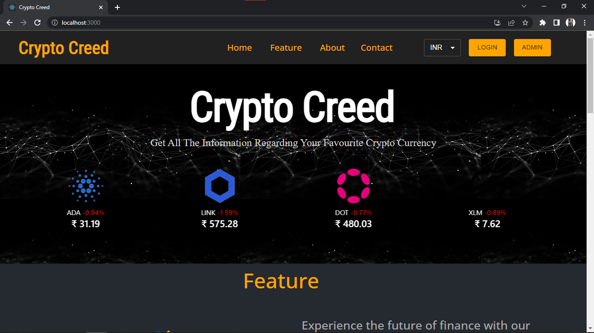

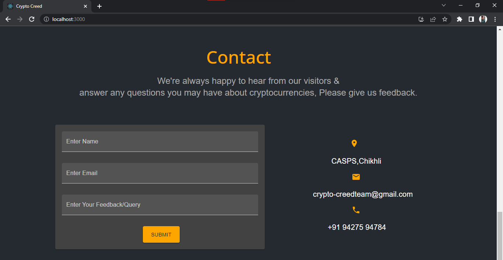
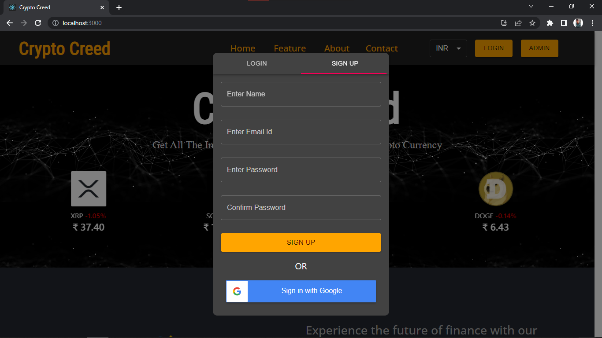
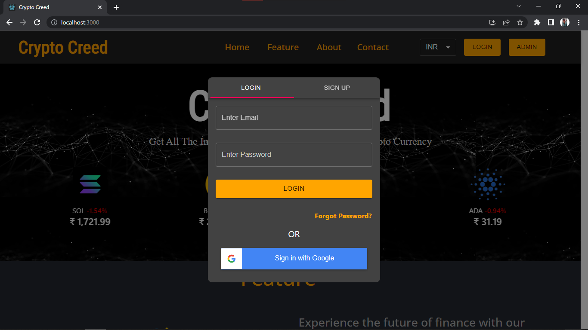

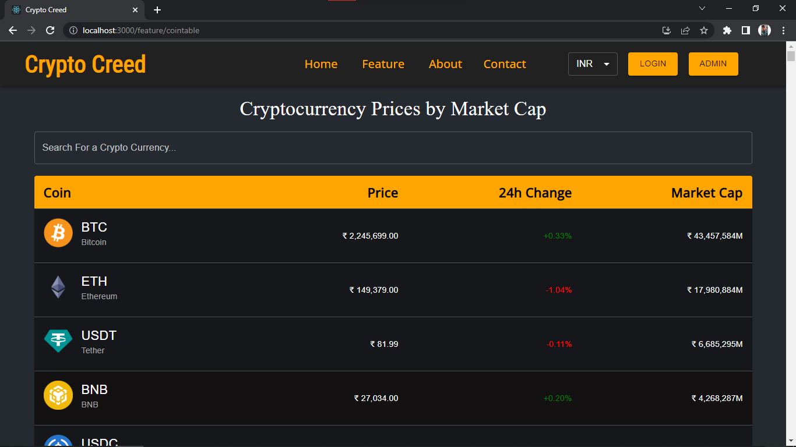
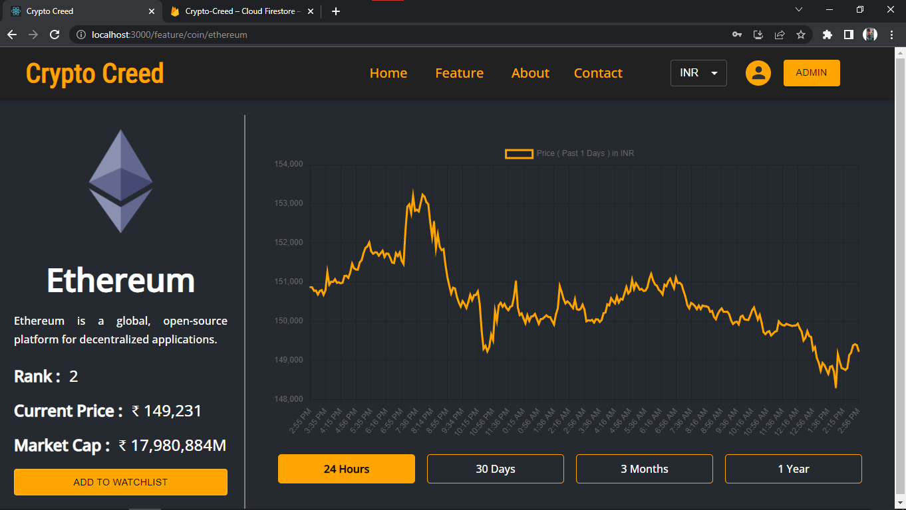
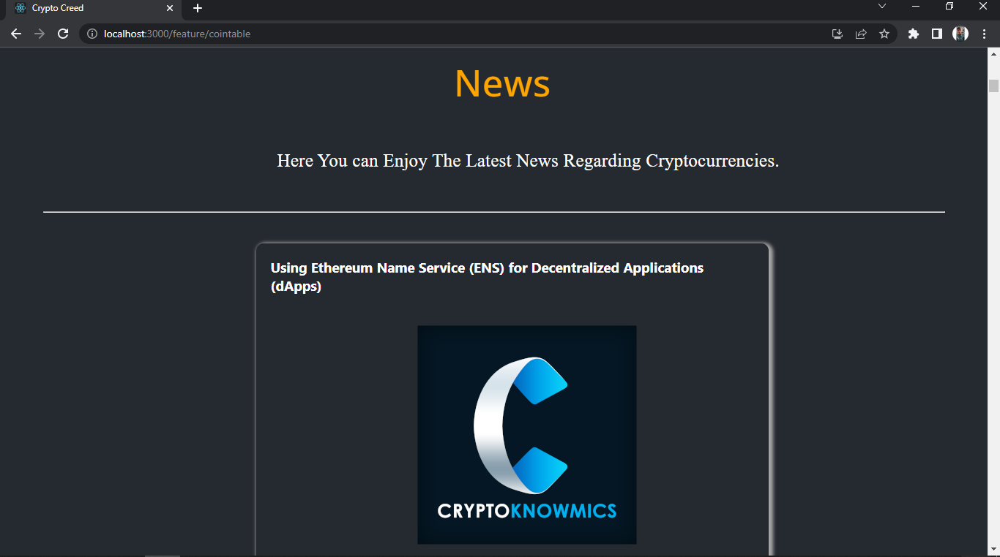
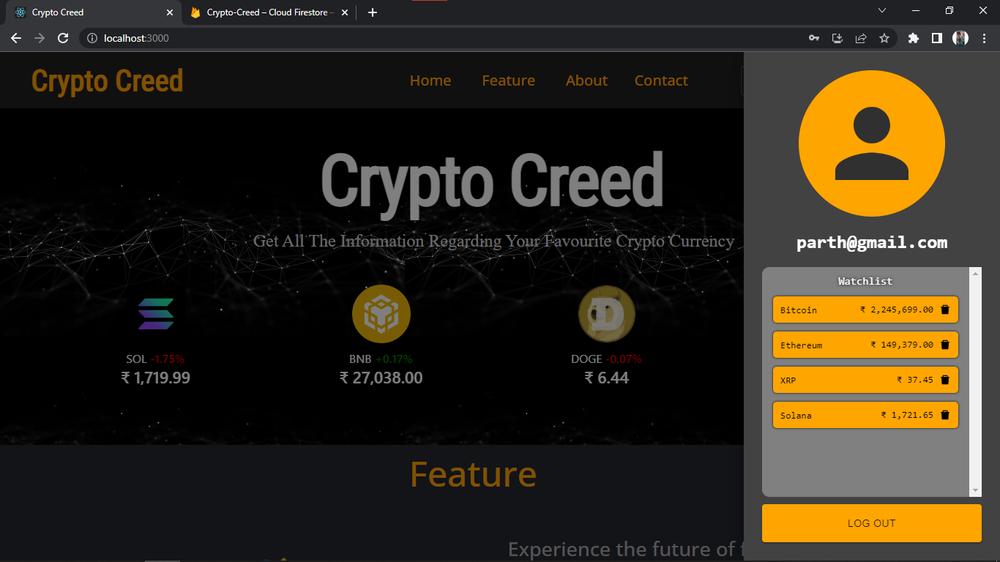
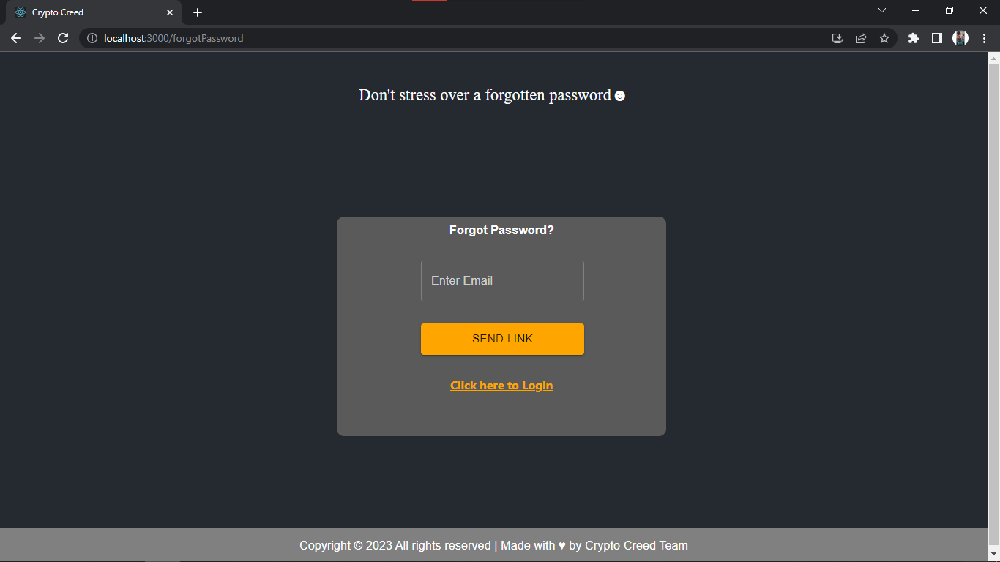
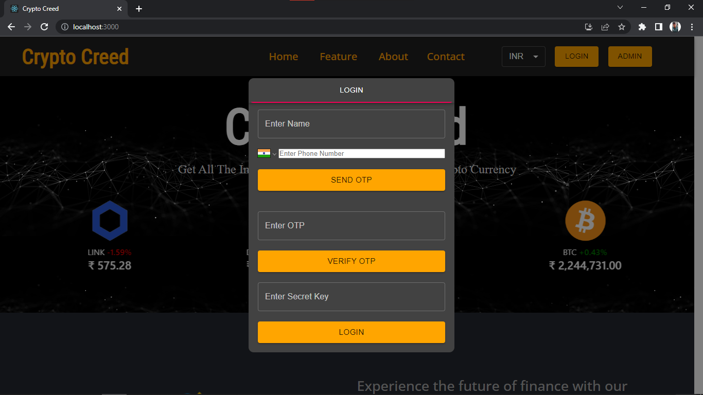
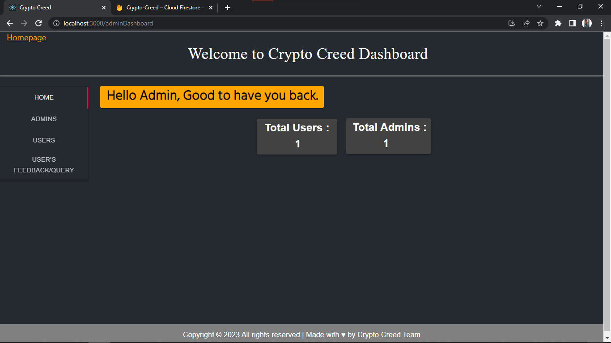
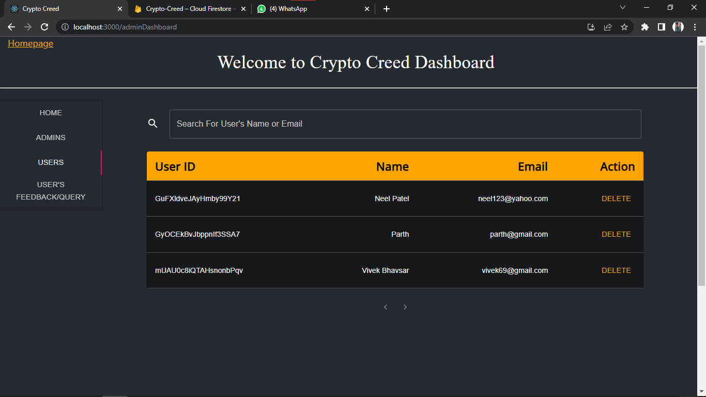
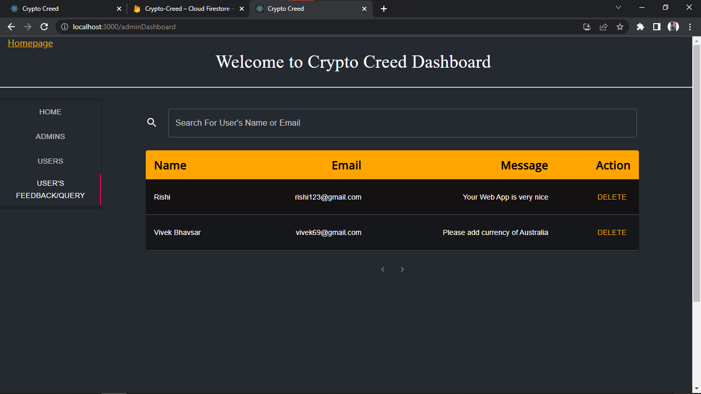
